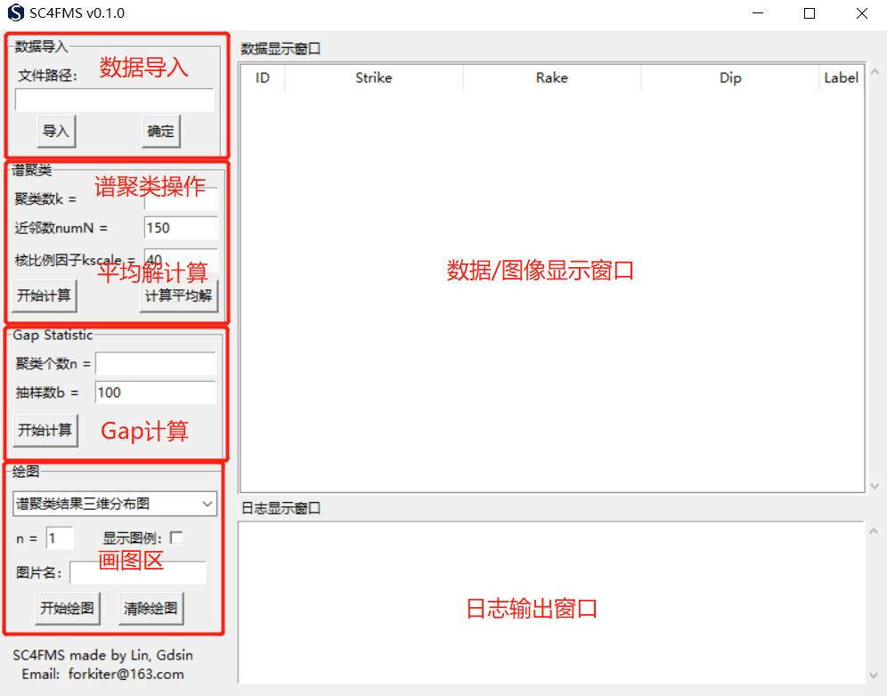

# 震源机制解的谱聚类

# Spectral Clustering for Focal Mechanism Solutions

***

## 简介

**震源机制解的谱聚类**（SC4FMS）是一套专为震源机制解的聚类而设计的软件。针对震源机制解数据的特点，采用最小旋转角为相似度矩阵，利用NCut切图准则完成类型判别，以Gap统计确定聚类数的最优解，从而对海量的震源机制解数据进行快速准确的类型划分。

该软件包含的功能如下：

- 震源机制解的谱聚类；
- 求取每类震源机制解的平均解；
- 利用Gap-Statistics方法计算最佳聚类数；
- 相关的图件绘制。

##### Developer: Lin Qingxi (Email: forkiter@163.com)

***

## 安装

SC4FMS支持多种操作平台，包括macOS, Linux和Windows操作系统。运行该程序需要安装Python 3.x（3.7和3.8已测试可以完美运行，其它版本可自行测试）。通过GitHub下载源程序：

```
git clone git://github.com/forkiter/SC4FMS
```

1. ##### 建议先安装虚拟环境。

```
conda create -n SC4FMS python=3.8
conda activate SC4FMS
```

2. ##### 安装运行该程序所需的模块。

```python
pip install pandas
pip install scipy
pip install matplotlib
```

##### 	或者

```python
pip install -r requirements.txt
```

3. ##### 在主程序目录运行run_gui.py。

```python
python run_gui.py
```

若弹出程序主界面，则表示安装成功；否则，请根据Trackback提示进行其它模块安装，或直接联系作者。

***

## 使用

SC4FMS有独立的图形用户界面（GUI），可方便用户交互操作；也可以使用python语言进行批处理，最大限度保证用户方便快捷使用。



GUI窗口功能区见图所示。或使用python命令进行相关操作。

#### example

```python
from core.sc4fms import ScFms

sc = ScFms("D:\SC4FMS\data\example_data.csv")
sc.spectral_cluster_com(k=8)
sc.plot_3d(sc.user_labels('sc'), show_legend=1)
```

具体操作请详见用户手册（/docs/UserGuide.pdf）

***

## 说明

本软件完全开源，欢迎相关开发经验者和作者继续合作开发完善。

如使用过程中出现bug，或其它问题，可以随时邮件联系作者。Email: forkiter@163.com

如使用本软件，可引用以下文章：

林庆西, 姜喜姣. 2023. 震源机制解谱聚类方法的研究及应用. 中国地震, 39(1):64~77.
